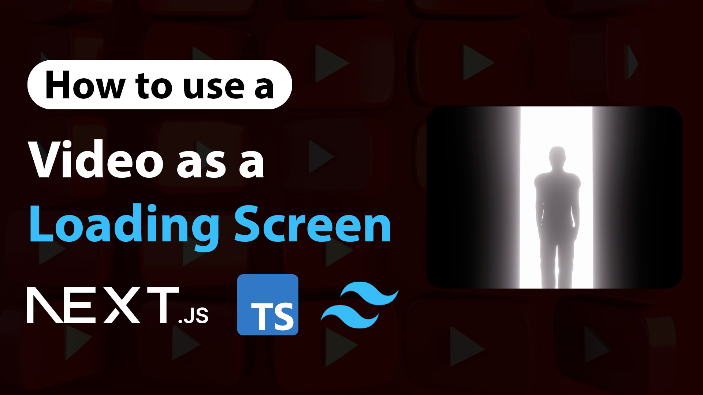

# How to use Video as a Loading Screen | Video Reveal Loading Screen in Next.js | TypeScript, Tailwind CSS 

Youtube Tutorial Link: https://youtu.be/N3XgFFSyWCA

Learn how to create a video-based loading screen in Next.js using TypeScript and Tailwind CSS—no animation libraries required. This project shows you how to display a full-screen video while your content loads, then smoothly transition to the main page. It’s a creative and visually appealing way to enhance user experience using only built-in tools and CSS utilities.
